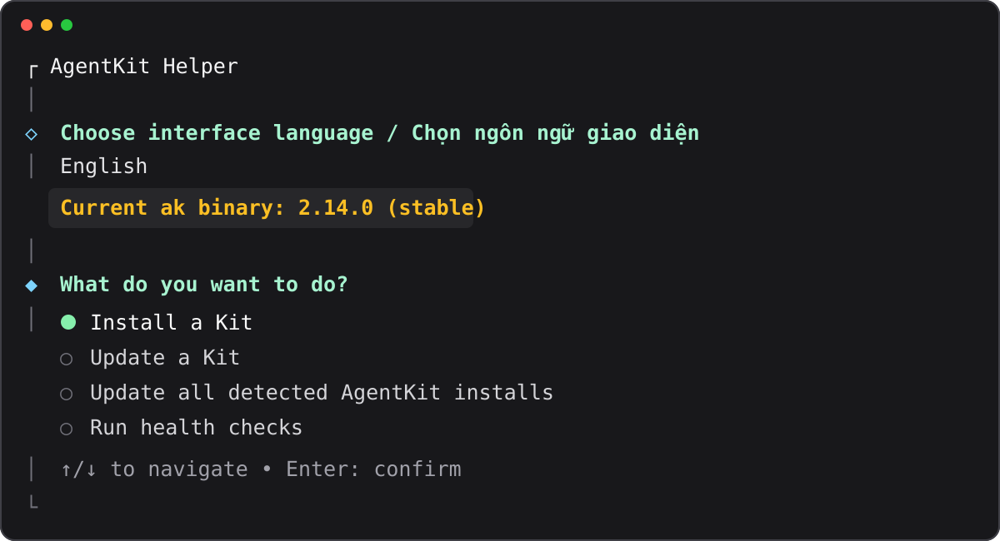

# AgentKit Helper

[Tiếng Việt](./README.vi.md)

A friendly TUI for installing and updating AgentKit Kits. It detects your
`ak` binary, asks a few questions, shows the official command, and runs it for
you.



## Start

Requires Node.js 20.12+ and the `ak` CLI.

```bash
npx --yes @thieung/agentkit-helper
```

For the shorter `akh` command:

```bash
npm install --global @thieung/agentkit-helper
akh
```

In the TUI, use:

- ↑/↓ to navigate
- Space to select multiple runtimes
- Enter to confirm
- `← Back` to return to the previous step

Choose a project or user/global scope, Engineer or Marketing Kit, one or more
runtimes, and the Stable or Beta channel. AgentKit remains responsible for Kit
verification, ownership, snapshots, and runtime-specific files.

For global install, the helper first runs without `--force`. If the target
already exists or drift is detected, the TUI shows a WARNING and asks for
separate consent, defaulting to No. It retries with `--force` only after you
choose Yes. Global update is preserve-only: user-modified files are skipped
and the helper never adds `--force`.

<details>
<summary><strong>Advanced CLI usage</strong></summary>

Install into a project:

```bash
akh install --project /path/to/project --kit engineer \
  --runtime codex --channel stable
```

Install into runtime user/global scope:

```bash
akh install --global --kit engineer \
  --runtime codex,omp,pi --channel stable
```

Update Kit installs or only the signed `ak` binary:

```bash
akh update --project /path/to/project
akh update-all --channel stable
akh self-update --channel stable
```

Preview without applying changes:

```bash
akh update --project /path/to/project --dry-run
```

Targets:

- Install: `claude-code`, `codex`, `cursor`, `dsh`, `grok`, `omp`, `pi`
- Update: `claude-code`, `codex`, `cursor`, `grok`, `omp`, `pi`
- Export: `agy`, `portable`

Run `akh --help` for every command and option.

</details>

## Development

```bash
npm ci
npm run check
npm test
```

MIT License
