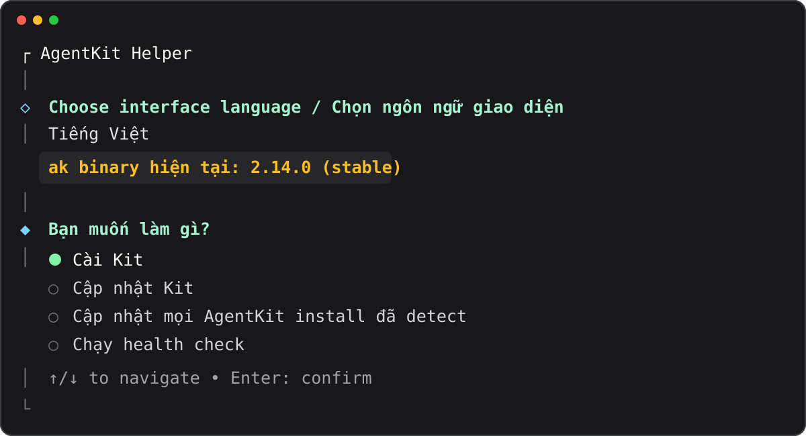

# AgentKit Helper

[English](./README.md)

TUI thân thiện giúp cài đặt và cập nhật AgentKit Kit. Helper tự detect `ak`
binary, hỏi một vài lựa chọn, hiển thị command chính thức rồi chạy giúp bạn.



## Bắt đầu

Yêu cầu Node.js 20.12+ và `ak` CLI.

```bash
npx --yes @thieung/agentkit-helper
```

Muốn dùng command ngắn `akh`:

```bash
npm install --global @thieung/agentkit-helper
akh
```

Trong TUI, dùng:

- ↑/↓ để di chuyển
- Space để chọn nhiều runtime
- Enter để xác nhận
- Esc để trở về bước trước

TUI có hai việc chính: **Cập nhật** và **Cài Kit**. Cập nhật detect binary `ak`,
Kit global, và Kit của project hiện tại khi AgentKit sở hữu thư mục đó. Cài Kit
hỏi scope project hoặc user/global, Engineer hoặc Marketing Kit, runtime, và
Stable hoặc Beta. **Khác** ẩn export, doctor và cập nhật tất cả. Khi thư mục
hiện tại là project hợp lệ (không phải `/` hay home), Cài Kit có **Dùng project
hiện tại**; CLI tương đương là `--project .`. AgentKit vẫn quản lý việc xác minh
Kit, ownership, snapshot và file riêng của từng runtime.

Khi cài global scope, helper chạy trước mà không có `--force`. Nếu target đã
tồn tại hoặc có drift, TUI hiển thị WARNING và hỏi consent riêng, mặc định No.
Chỉ khi chọn Yes, helper mới retry bằng `--force`. Global update luôn dùng
preserve-only: file do user chỉnh sửa được bỏ qua và helper không thêm `--force`.

Trạng thái platform: macOS đã được verify local. Linux là target được hỗ trợ
qua code path Node.js portable. Native Windows PowerShell đang ở mức
experimental cho đến khi được smoke-test trên máy thật; repository đã có xử lý
command và CI dành cho Windows nhưng chưa claim provider-backed E2E.

Checklist smoke Windows (thủ công; giữ experimental cho đến khi chạy xong trên
máy thật):

1. Cài `ak` bằng `irm https://agentkit.best/install.ps1 | iex`, rồi mở terminal
   mới.
2. Chạy `npx --yes @thieung/agentkit-helper` (hoặc `akh` sau khi npm install
   global).
3. Trong TUI, chọn **Cài Kit**, rồi **Dùng project hiện tại** (hoặc
   `akh install --project .`).
4. Cài một runtime, rồi chạy `akh update`.

<details>
<summary><strong>Cách dùng CLI nâng cao</strong></summary>

Cài vào project:

```bash
akh install --project /path/to/project --kit engineer \
  --runtime codex --channel stable
```

Cài vào user/global scope của runtime:

```bash
akh install --global --kit engineer \
  --runtime codex,omp,pi --channel stable
```

Cài vào máy chủ Linux VPS qua SSH:

```bash
akh install --ssh user@host --kit engineer \
  --runtime codex --channel stable
```

Cập nhật Kit trên máy chủ Linux VPS qua SSH:

```bash
akh update --ssh user@host
akh update --ssh user@host --runtime codex
```

`--ssh <host>` (alias `--vps`) nhắm mục tiêu vào Linux VPS qua system SSH. Tùy chọn này tự động gán `--global`, kiểm tra binary `ak` trên remote, discover danh sách Kit đã cài qua một probe duy nhất, fail-closed nếu runtime yêu cầu chưa được cài trên VPS, và lưu lại danh sách host gần đây trong `~/.agentkit-helper/config.json`. Nếu `ak` chưa có trên VPS, chế độ interactive sẽ hỏi để tự động bootstrap qua installer chính thức.

Cập nhật:

```bash
akh update
akh update --project /path/to/project
akh update --all --channel stable
akh update --dry-run
```

`akh update` dùng channel của `ak` binary đang cài trừ khi có `--channel`. Ở
`/` hoặc home thì cập nhật binary và **mọi runtime đã cài global** mà helper
detect được (`claude-code`, `codex`, `cursor`, `dsh`, `grok`, `omp`, `pi`, kèm
profile `pi-ak`/`pi-omp` nếu có). Ở project do AgentKit sở hữu thì cập nhật
thêm Kit của project đó. CLI one-shot áp dụng ngay; `akh update --dry-run` chỉ
preview. `akh update --all` thêm project trong registry và deep scan tùy chọn.

Runtime: `claude-code`, `codex`, `cursor`, `dsh`, `grok`, `omp`, `pi`, `pi-ak`, `pi-omp`

Update `dsh` đi qua `ak kit refresh` vì `ak update` remote vẫn reject runtime này. `pi-ak` và `pi-omp` là alias profile chỉ dùng với `--global`; chúng cài/cập nhật vào home Pi/OMP custom, không phải thư mục `pi`/`omp` mặc định.

Chạy `akh --help` để xem toàn bộ command và option.

</details>

## Phát triển local

```bash
npm ci
npm run check
npm test
```

MIT License
